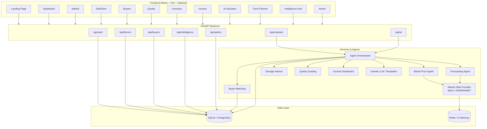
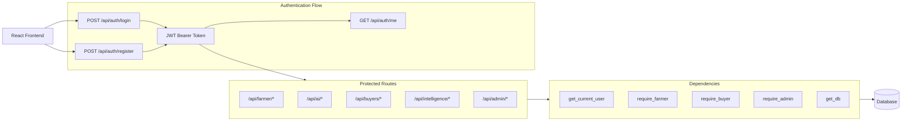
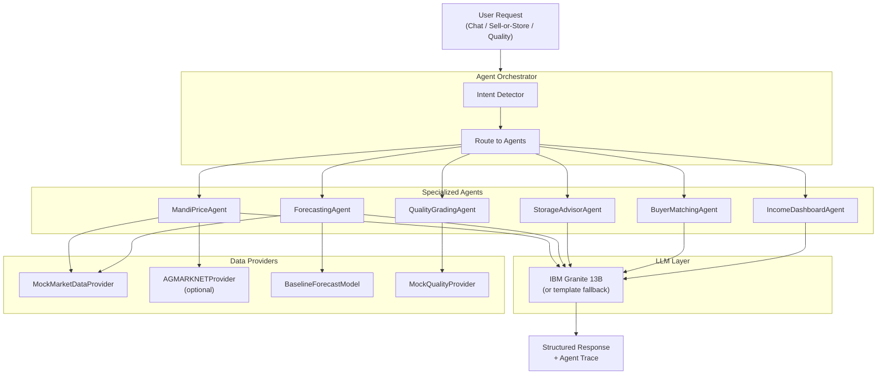
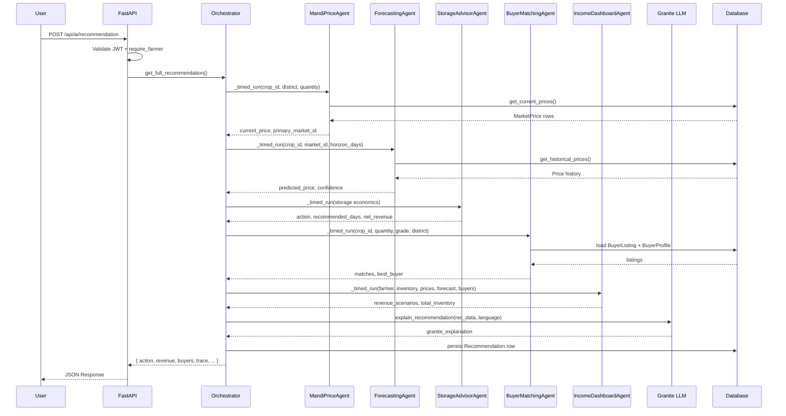
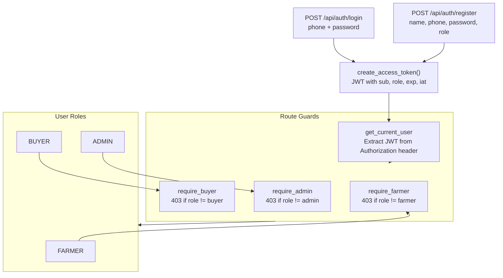
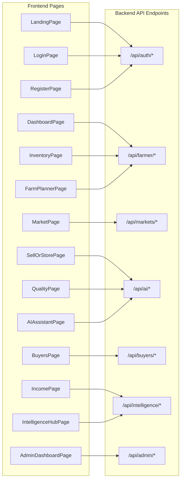
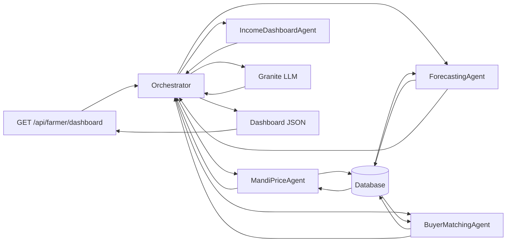

# KhedutMitra AI — Backend & Database Diagrams

## 1. High-Level Architecture



---

## 2. Database ER Diagram

```mermaid
erDiagram
    USER ||--o| FARMER_PROFILE : "has"
    USER ||--o| BUYER_PROFILE : "has"
    USER ||--o{ FARMER_INVENTORY : "owns"
    USER ||--o{ CONVERSATION : "starts"
    USER ||--o{ QUALITY_ASSESSMENT : "uploads"
    USER ||--o{ RECOMMENDATION : "receives"
    USER ||--o{ PRICE_ALERT : "creates"
    USER ||--o{ EXPENSE : "logs"
    USER ||--o{ RATING : "rates"
    USER ||--o{ COOPERATIVE_MEMBER : "joins"

    CROP ||--o{ FARMER_INVENTORY : "categorizes"
    CROP ||--o{ MARKET_PRICE : "priced as"
    CROP ||--o{ FORECAST : "forecasted"
    CROP ||--o{ BUYER_LISTING : "requires"

    MANDI_MARKET ||--o{ MARKET_PRICE : "records"
    MANDI_MARKET ||--o{ FORECAST : "targets"

    BUYER_PROFILE ||--o{ BUYER_LISTING : "publishes"
    BUYER_LISTING ||--o{ OFFER : "receives"
    BUYER_LISTING ||--o{ BUYER_MATCH : "matches"

    FARMER_INVENTORY ||--o{ OFFER : "offers via"
    FARMER_INVENTORY ||--o{ QUALITY_ASSESSMENT : "assessed"
    FARMER_INVENTORY ||--o{ RECOMMENDATION : "recommended for"

    CONVERSATION ||--o{ MESSAGE : "contains"

    COOPERATIVE ||--o{ COOPERATIVE_MEMBER : "includes"

    OFFER ||--o{ DEAL : "creates"
    OFFER ||--o{ RATING : "rated in"

    USER {
        string id PK
        string name
        string phone UK
        string email UK
        string password_hash
        enum role "farmer|buyer|admin"
        enum language "gu|hi|en"
        string location
        boolean is_active
        datetime created_at
        datetime updated_at
    }

    FARMER_PROFILE {
        string id PK
        string user_id FK
        string village
        string district
        string state
        enum preferred_language
        float farm_size_acres
        string aadhaar_number
        string bank_account_number
        string ifsc_code
        datetime created_at
    }

    BUYER_PROFILE {
        string id PK
        string user_id FK
        string business_name
        enum buyer_type
        text address
        string district
        float latitude
        float longitude
        string gst_number
        string verification_status
        boolean is_active
        datetime created_at
    }

    CROP {
        string id PK
        string name
        string name_gu
        string name_hi
        enum category "cotton|groundnut"
        string unit
        text description
        boolean is_active
    }

    FARMER_INVENTORY {
        string id PK
        string farmer_id FK
        string crop_id FK
        float quantity
        string unit
        enum quality_grade "A|B|C|ungraded"
        datetime harvest_date
        boolean storage_available
        float storage_cost_per_quintal_per_day
        string village
        string district
        float latitude
        float longitude
        text notes
        boolean is_active
        datetime created_at
        datetime updated_at
    }

    MANDI_MARKET {
        string id PK
        string name
        string name_gu
        string district
        string state
        float latitude
        float longitude
        string contact
        boolean is_active
    }

    MARKET_PRICE {
        string id PK
        string market_id FK
        string crop_id FK
        datetime price_date
        numeric min_price
        numeric max_price
        numeric modal_price
        float arrivals_tonnes
        string source
        boolean is_demo
        datetime created_at
    }

    FORECAST {
        string id PK
        string crop_id FK
        string market_id FK
        datetime forecast_date
        datetime target_date
        integer horizon_days
        numeric predicted_price
        numeric lower_bound
        numeric upper_bound
        float confidence
        string model_version
        text factors
        boolean is_demo
    }

    BUYER_LISTING {
        string id PK
        string buyer_profile_id FK
        string crop_id FK
        float min_quantity
        float max_quantity
        enum quality_requirement
        numeric offered_price
        string district
        float latitude
        float longitude
        integer delivery_days
        boolean is_active
        boolean is_demo
        datetime created_at
        datetime expires_at
    }

    BUYER_MATCH {
        string id PK
        string farmer_id FK
        string buyer_listing_id FK
        string inventory_id FK
        float match_score
        text score_breakdown
        text reason
        datetime created_at
    }

    OFFER {
        string id PK
        string farmer_id FK
        string buyer_listing_id FK
        string inventory_id FK
        numeric offered_price
        float quantity
        text message
        enum status "pending|accepted|rejected|withdrawn|completed"
        datetime created_at
        datetime updated_at
    }

    QUALITY_ASSESSMENT {
        string id PK
        string farmer_id FK
        string inventory_id FK
        string image_url
        string crop_type
        text assessment_result
        float confidence
        string suggested_grade
        text disclaimer
        string provider
        datetime created_at
    }

    RECOMMENDATION {
        string id PK
        string farmer_id FK
        string inventory_id FK
        enum action "SELL_NOW|STORE|WAIT"
        integer recommended_days
        numeric current_revenue
        numeric expected_future_revenue
        numeric storage_cost
        numeric transport_cost
        numeric quality_loss_cost
        numeric expected_net_revenue
        numeric potential_gain
        float confidence
        text explanation
        text explanation_gu
        text explanation_hi
        text agent_trace
        datetime created_at
    }

    CONVERSATION {
        string id PK
        string farmer_id FK
        string session_id
        datetime created_at
    }

    MESSAGE {
        string id PK
        string conversation_id FK
        string role "user|assistant|system"
        text message
        string agent_used
        enum language
        datetime created_at
    }

    PRICE_ALERT {
        string id PK
        string farmer_id FK
        string crop_id
        float threshold_price
        string direction "above|below"
        boolean is_active
        datetime last_triggered_at
        datetime created_at
    }

    EXPENSE {
        string id PK
        string farmer_id FK
        string crop_id
        string category
        numeric amount
        datetime incurred_date
        text notes
        datetime created_at
    }

    DEAL {
        string id PK
        string farmer_id FK
        string offer_id FK
        string status
        numeric agreed_price
        float agreed_quantity
        datetime delivery_date
        numeric transport_cost
        numeric storage_cost
        datetime created_at
        datetime updated_at
    }

    RATING {
        string id PK
        string rater_id FK
        string rated_user_id FK
        string offer_id FK
        integer score
        text comment
        datetime created_at
    }

    COOPERATIVE {
        string id PK
        string name
        string district
        string created_by FK
        datetime created_at
    }

    COOPERATIVE_MEMBER {
        string id PK
        string cooperative_id FK
        string farmer_id FK
        datetime joined_at
    }

    WEATHER_SNAPSHOT {
        string id PK
        string farmer_id FK
        string district
        datetime forecast_date
        float rainfall_mm
        float temperature_c
        float humidity_percent
        string alert
        string source
        boolean is_demo
        datetime created_at
    }
```



---

## 3. API Routing & Request Flow



---

## 4. AI Agent Orchestration Pipeline



**Intent → Agent Mapping:**

| Intent | Agents Invoked |
|--------|---------------|
| `MARKET_PRICE` | MandiPriceAgent |
| `PRICE_FORECAST` | MandiPriceAgent, ForecastingAgent |
| `SELL_OR_STORE` | MandiPriceAgent, ForecastingAgent, StorageAdvisorAgent, BuyerMatchingAgent, IncomeDashboardAgent |
| `FIND_BUYER` | MandiPriceAgent, BuyerMatchingAgent |
| `QUALITY_CHECK` | QualityGradingAgent |
| `INCOME` | MandiPriceAgent, ForecastingAgent, BuyerMatchingAgent, IncomeDashboardAgent |

---

## 5. Sell-or-Store Request Flow (Deep Dive)



---

## 6. Authentication & Role Guard Flow



---

## 7. Frontend Module → API Mapping



---

## 8. Database Table Relationships Summary

```
users
  ├── farmer_profiles (1:1)
  ├── buyer_profiles (1:1)
  ├── farmer_inventory (1:N)
  ├── conversations (1:N)
  ├── quality_assessments (1:N)
  ├── recommendations (1:N)
  ├── price_alerts (1:N)
  ├── expenses (1:N)
  ├── ratings (1:N)
  └── cooperative_members (1:N)

crops
  ├── farmer_inventory (1:N)
  ├── market_prices (1:N)
  ├── forecasts (1:N)
  └── buyer_listings (1:N)

mandi_markets
  ├── market_prices (1:N)
  └── forecasts (1:N)

buyer_profiles
  └── buyer_listings (1:N)

buyer_listings
  ├── offers (1:N)
  └── buyer_matches (1:N)

farmer_inventory
  ├── offers (1:N)
  ├── quality_assessments (1:N)
  └── recommendations (1:N)

conversations
  └── messages (1:N)

cooperatives
  └── cooperative_members (1:N)

offers
  ├── deals (1:N)
  └── ratings (1:N)
```

---

## 9. Data Flow: Market Price to Dashboard



---

## 10. Key Backend Design Patterns

| Pattern | Implementation |
|---------|---------------|
| **API Gateway** | Single FastAPI app with CORS middleware |
| **Repository** | SQLAlchemy ORM models + async sessions |
| **Service Layer** | `app/services/*` for market data, forecasts, quality, Granite |
| **Agent Pattern** | `app/agents/*` with `AgentResult` base class and `_timed_run` |
| **Orchestrator** | `AgentOrchestrator` routes intents to agent pipelines |
| **Dependency Injection** | FastAPI `Depends(get_db)`, `Depends(require_farmer)` |
| **JWT Auth** | Bearer tokens with role claims + refresh guards |
| **Demo Fallback** | `is_demo` flags, mock providers, template-mode Granite |
| **Async I/O** | Async SQLAlchemy + asyncpg / SQLite |
| **Structured Logging** | `structlog` with request timing middleware |

---

*Generated from backend code in `D:\test\khedutmitra-ai\backend`*
